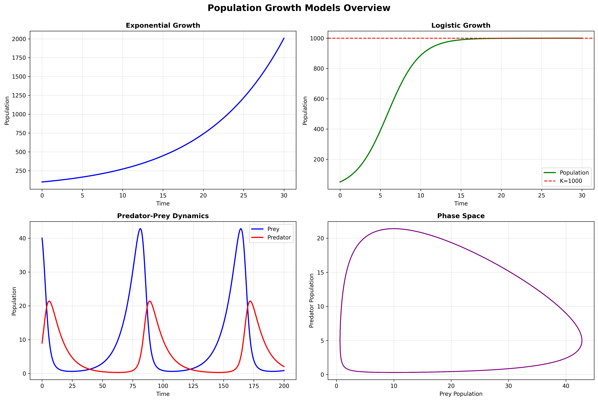
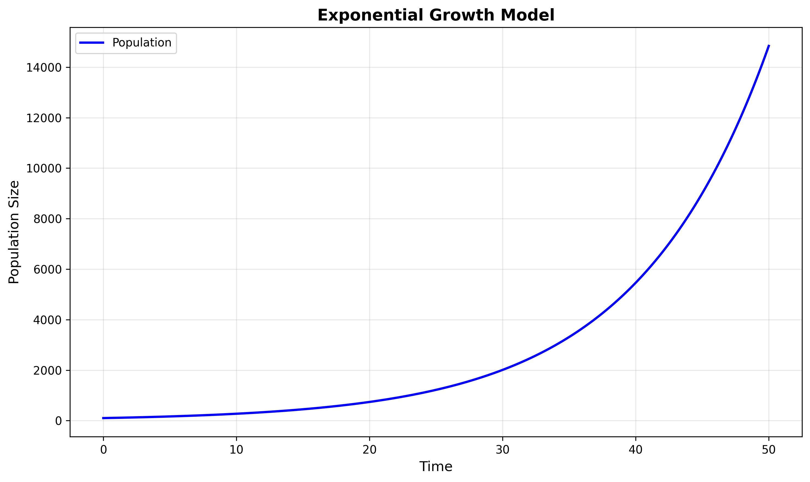
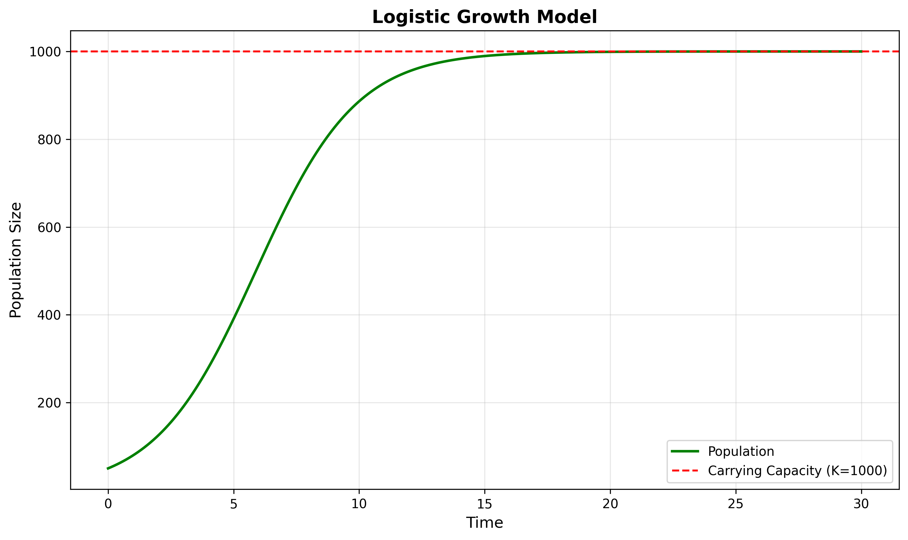
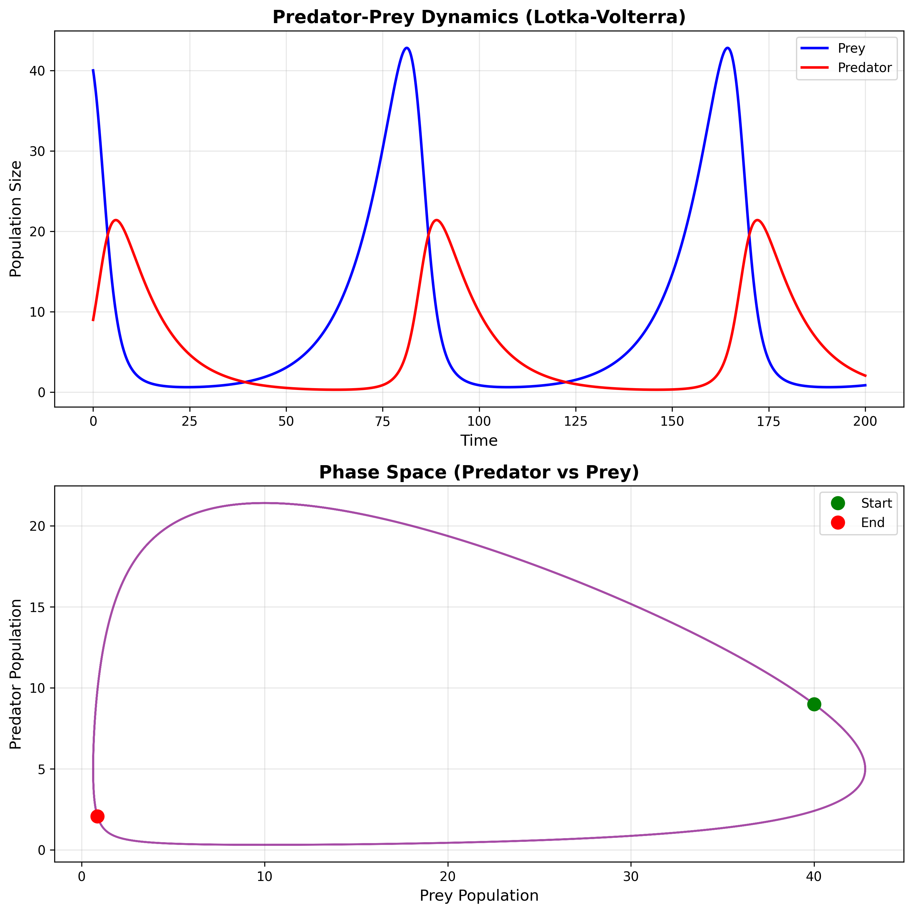

# Population Growth Model

A comprehensive Python implementation of various population growth models including exponential growth, logistic growth, and predator-prey dynamics. This project demonstrates the application of numerical methods to solve differential equations and visualize population dynamics over time.

## Overview

This project implements three fundamental population models from ecology and biology:

1. **Exponential Growth Model** - Unbounded population growth
2. **Logistic Growth Model** - Growth limited by carrying capacity
3. **Predator-Prey Model** - Lotka-Volterra dynamics between two interacting species

Each model uses numerical methods (Euler's method and 4th-order Runge-Kutta) to solve the underlying differential equations.

## Features

- **Multiple Growth Models**: Exponential, logistic, and predator-prey dynamics
- **Numerical Solvers**: Both Euler's method and RK4 for solving ODEs
- **Analytical Solutions**: Comparison with exact solutions where available
- **Comprehensive Visualizations**: Time series plots, phase space diagrams, and comparative analyses
- **Well-Documented Code**: Clear documentation and examples for each model

## Installation

1. Clone the repository:
```bash
git clone https://github.com/GIL794/Population-Growth-Model.git
cd Population-Growth-Model
```

2. Install required dependencies:
```bash
pip install -r requirements.txt
```

## Usage

### Running the Examples

Run the main script to generate all example visualizations:

```bash
python main.py
```

This will create six visualization files:
- `exponential_growth.png` - Exponential growth over time
- `logistic_growth.png` - Logistic growth with carrying capacity
- `predator_prey.png` - Predator-prey dynamics with phase space
- `method_comparison.png` - Comparison of numerical methods
- `multiple_scenarios.png` - Effect of different parameters
- `comprehensive_report.png` - Overview of all models

### Using Individual Models

#### Exponential Growth

```python
import numpy as np
from population_models import ExponentialGrowth
from visualization import plot_exponential_growth

# Setup
r = 0.1  # Growth rate
N0 = 100  # Initial population
t = np.linspace(0, 50, 500)

# Solve
model = ExponentialGrowth(growth_rate=r)
N = model.solve(N0, t)

# Visualize
plot_exponential_growth(t, N)
```

#### Logistic Growth

```python
import numpy as np
from population_models import LogisticGrowth
from visualization import plot_logistic_growth

# Setup
r = 0.5  # Growth rate
K = 1000  # Carrying capacity
N0 = 50  # Initial population
t = np.linspace(0, 30, 500)

# Solve
model = LogisticGrowth(growth_rate=r, carrying_capacity=K)
N = model.solve(N0, t)

# Visualize
plot_logistic_growth(t, N, K)
```

#### Predator-Prey Dynamics

```python
import numpy as np
from population_models import PredatorPreyModel
from visualization import plot_predator_prey

# Setup
alpha = 0.1   # Prey growth rate
beta = 0.02   # Predation rate
delta = 0.01  # Predator efficiency
gamma = 0.1   # Predator death rate
N0 = 40  # Initial prey
P0 = 9   # Initial predator
t = np.linspace(0, 200, 2000)

# Solve
model = PredatorPreyModel(alpha, beta, delta, gamma)
prey, predator = model.solve(N0, P0, t)

# Visualize
plot_predator_prey(t, prey, predator)
```

## Example Visualizations

When you run `python main.py`, the program generates comprehensive visualizations of all population growth models. Here's what you can expect to see:

### Comprehensive Overview

The program creates a comprehensive report showing all three models in one view:



This overview includes:
- **Top Left**: Exponential growth showing unbounded population increase
- **Top Right**: Logistic growth with the characteristic S-curve approaching carrying capacity
- **Bottom Left**: Predator-prey dynamics showing oscillating populations over time
- **Bottom Right**: Phase space diagram showing the cyclical relationship between predators and prey

### Individual Model Outputs

#### Exponential Growth


Shows the characteristic exponential increase in population over time when resources are unlimited.

#### Logistic Growth


Demonstrates how populations grow rapidly at first but slow down as they approach the carrying capacity (shown as the red dashed line).

#### Predator-Prey Dynamics


Illustrates the classic Lotka-Volterra dynamics:
- **Top panel**: Time series showing how prey and predator populations oscillate over time
- **Bottom panel**: Phase space showing the cyclical trajectory with start (green) and end (red) points

All visualizations are saved as high-resolution PNG files in your working directory.

## Mathematical Models

### 1. Exponential Growth

**Differential Equation:**
```
dN/dt = r × N
```

**Analytical Solution:**
```
N(t) = N₀ × e^(rt)
```

Where:
- N = population size
- r = intrinsic growth rate
- t = time

### 2. Logistic Growth

**Differential Equation:**
```
dN/dt = r × N × (1 - N/K)
```

**Analytical Solution:**
```
N(t) = K / (1 + ((K - N₀) / N₀) × e^(-rt))
```

Where:
- N = population size
- r = intrinsic growth rate
- K = carrying capacity
- t = time

### 3. Predator-Prey Model (Lotka-Volterra)

**System of Differential Equations:**
```
dN/dt = α × N - β × N × P  (Prey)
dP/dt = δ × N × P - γ × P  (Predator)
```

Where:
- N = prey population
- P = predator population
- α = prey growth rate
- β = predation rate
- δ = predator efficiency
- γ = predator death rate

## Numerical Methods

### Euler's Method
A simple first-order method for solving ODEs:
```
y(t + Δt) = y(t) + Δt × f(y, t)
```

### Runge-Kutta 4th Order (RK4)
A more accurate fourth-order method:
```
y(t + Δt) = y(t) + (Δt/6) × (k₁ + 2k₂ + 2k₃ + k₄)
```

## Project Structure

```
Population-Growth-Model/
│
├── population_models.py    # Core population model implementations
├── visualization.py         # Plotting and visualization functions
├── main.py                 # Example usage and demonstrations
├── requirements.txt        # Python dependencies
└── README.md              # This file
```

## Requirements

- Python 3.7+
- NumPy >= 1.20.0
- Matplotlib >= 3.3.0

## Applications

This project demonstrates concepts useful in:

- **Ecology**: Understanding population dynamics in natural ecosystems
- **Biology**: Modeling species growth and interactions
- **Epidemiology**: Similar models apply to disease spread
- **Applied Mathematics**: Numerical methods for differential equations
- **Computational Science**: Scientific computing and visualization

## Contributing

Contributions are welcome! Feel free to submit issues or pull requests.

## License

This project is open source and available for educational purposes.

## Author

GIL794

## Acknowledgments

- Based on classical population dynamics models from ecology and biology
- Implements numerical methods for solving ordinary differential equations
- Inspired by the work of Alfred J. Lotka and Vito Volterra on predator-prey dynamics
